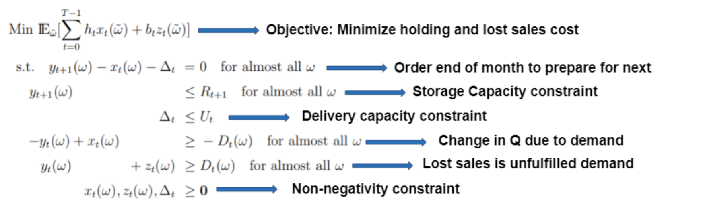
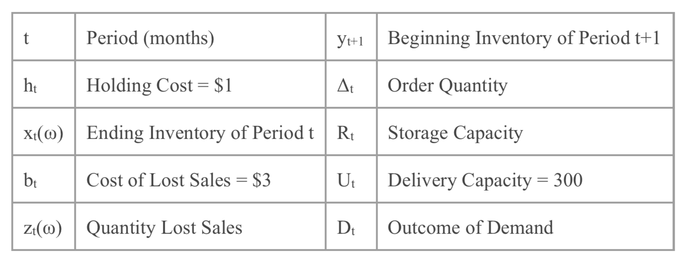
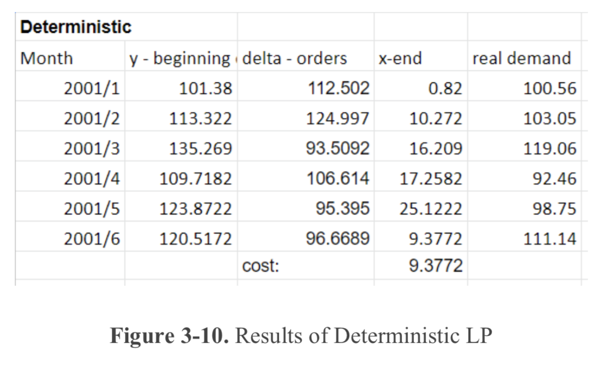
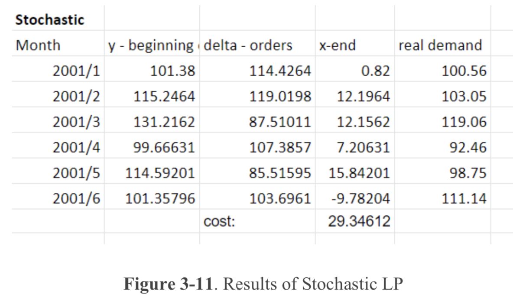

# Inventory-Control-and-Demand-Forecasting

## Introduction
A common problem faced by businesses that sell consumer goods is predicting future demand to place an order that would minimize the chances of a shortage while also minimizing the costs of holding an inventory. 

The objective of the Inventory Control and Demand Forecasting (ELECEQUIP) project is to 

minimize the cost of holding and lost sales by finding the optimal order quantity per month based on a demand time-series. Since demand by nature is stochastic, this project involves incorporating randomness and comparing the results of that model to a deterministic model. Then, we will evaluate whether incorporating randomness presented a more accurate demand prediction. Validation is done by splitting up the data into a training set and a validation set. Figure 3-1 presents a process flow diagram of the project.

First, we are given a demand data set of data which we will split into one training set with 5 years of demand data and the remaining will be used as the validation set. Then, using the training set, we will decompose the demand into the trend, seasonal, and random error components. Then, we will create a series of inventory planning models using ARIMA (AutoRegressive (AR) Integrated (I) Moving Average (MA)), a general time series model, recalculating the predictions with each additional month. Then, the sets of demand predictions and error terms are placed into a model (deterministic and stochastic) to output an order quantity which will then be inputted into the model once again to calculate a new starting inventory. An iterative process continues until we predict up to 6 months of demand, from which we can calculate the overall cost of holding and lost sales.
## Data
The elecequip data set is a time-series of 195 obs. from 1996 to 2012. In order to prepare the training set, we first selected 5 years of data and removed outliers using tsclean from the forecast package, thus creating the training dataset, a time-series of 60 obs. from 1996 to 2001 (Figure 3- 2).

## Check Stationarity
In order to use an ARIMA model, we first must ensure the data is stationary

To reduce non- stationarity, we “difference” the dataset and test for stationarity after removing the trend and seasonality from the dataset. We used two different tests for stationarity: the KPSS test and the Augmented Dickey-Fuller test.

For the KPSS Test, the null hypothesis is high stationarity, therefore we want a high p-value in order to not reject the null hypothesis. After performing the test, we do not reject the null hypothesis of stationarity because we received a p-value of 0.2877 which is larger than an alpha of 0.05

For the Augmented Dickey-Fuller Test, the lack of stationarity is the null hypothesis, while stationary is the alternative hypothesis. Therefore, should we receive a low p-value, we cannot reject stationarity. We received a low p-value of 0.01, which is less than an alpha of 0.05, therefore we reject the null hypothesis for non-stationary.

Since we passed both tests, the data is stationary and an ARIMA model can be used for predictions.

## Decomposition & Forecasting
We used two different functions to decompose the training set. First, we used Classical Seasonal Decomposition by Moving Averages (decompose) from the states package in R. Then we used Seasonal Decomposition of Time Series by Loess (stl) also from the stats package in R

The two decomposition functions yielded similar results. We decided to continue with Loess for predictions because it is a more advanced technique. We used ARIMA (auto.arima function from the forecast package) to model the data and create predictions for future demand.

We generated six sets of prediction data to begin the “rolling horizon approach” (Suvrajeet). This requires generating a 3 months of demand predictions in the future with each additional month of data. Since we want to predict 6 months into the future beginning in January 2001 and ending in June 2001, we first predicted using the training data set, then we predicted with the training data set plus one additional month of data, and so on and so forth until we get to the sixth month. This gives us 6 sets of data that includes 3 months of predicted demand and forecast errors

## Optimization Model

For our problem, the holding cost ht per quantity of inventory is $1, while the cost of lost sales bt per quantity is $3. We order at the end of each month by adding Δt , the order quantity, to the inventory at the end of the month xt to get the new inventory yt+1 at the beginning of the next month. After customers purchase the items, the beginning inventory decreases by the amount purchased Dt, which is demand, to find the new ending inventory xt+1. There are also constraints on storage capacity Rt as well as delivery capacity Ut. 

## Results and Evaluation
We enter the model into AMPL (Deterministic without errors) and Pyomo (Stochastic with errors). See Appendix for the code used to perform the optimization. Our results from the solvers can be seen below:

The stochastic model has a higher cost at the end than the deterministic model, which is unexpected as the stochastic model is expected to provide more accurate predictions due to the incorporation of randomness into its calculations. In order to check why the results seemed to veer from expectations, we plotted the cost for each month and compared the two models.

To validate our results, we used the Back-Testing approach. We first performed a two sample Chi-square test to ensure that the training and validation test sets are from the same distribution. We ended up with a p-value of 0.2382, which is greater than 0.05 significance level. Therefore,we do not reject the null hypothesis and conclude that the training and validation test sets have a significant relationship. We calculated the validation error for each month by subtracting observed demand from predicted demand, which gives us an average error of 7 units of difference between the predicted demand and the actual demand. Since the holding cost of those additional units is $1/unit, it does not seem to be costing the company a lot of money for the additional units predicted.

We recommend reiterating and predicting demand for at least 1 year using historical data in order to come to a more definite conclusion regarding the accuracy of the models.

